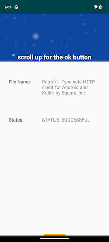

# FileDownloader App

## Getting Started

You should be able to run this app within Android Studio using Android Gradle Plugin version
8.1.4 Gradle version 8.0, and Java version 17. Make sure that you have notifications on
globally paying special attention to status bar icon, notification dot, and app settings.

### Dependencies

This project uses the following dependencies:
- AndroidX core
- AndroidX appcompat
- AndroidX constraintLayout
- Google Material
- AndroidX vectorDrawable

### Project Instructions

Running this app will take you to the Main Screen. This screen shows 3 radio buttons for choosing
which files to download. If you do not click one of these buttons and click "Download" you will
see a Toast message displayed indicating that no files were chosen.

Choosing one of the 3 buttons and clicking "Download" will initiate the download. You will see
2 animations on the button: a sweeping bar and a filling circle "progress" indicators. You will
then see an icon in the status bar, see a notification dot, and hear a notification sound once 
the download is complete and that there is a notification in your notification drawer (assuming 
that all of these settings are correct on your device).

Pulling down to view your notification drawer shows the notification. Clicking on the 
notification navigates the user to the Detail Screen, where the file name and download status
are shown. There are directions to scroll up to view the OK button.

Scrolling up shows MotionLayout animation on the screen and fades out the scrolling directions
text while fading in the button click directions. As well, the app bar background shows animation
as well. Clicking the OK button takes the user back to the Main screen again.

## Built With

* [Android Studio](https://developer.android.com/studio) - Default IDE used to build android apps
* [Kotlin](https://kotlinlang.org/) - Default language used to build this project
